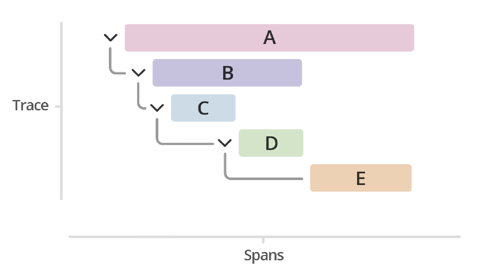
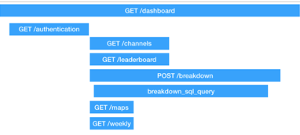
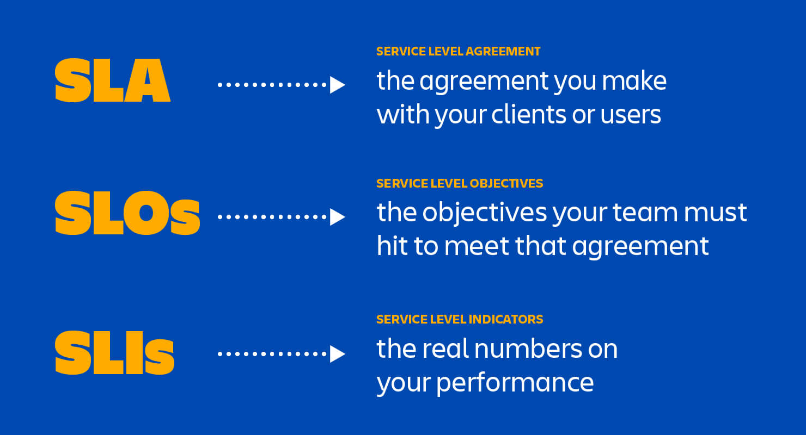
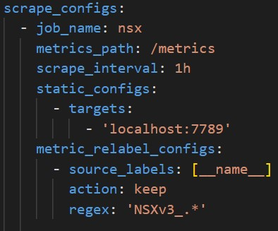

Télécom SudParis  

{:height=”30%” width=”30%”}

------------------------------------------------------------------------

  
**  
**

------------------------------------------------------------------------

   

{:height=”30%” width=”30%”}

# Observability concepts

## Metrics

In layperson terms, metrics are numeric measurements. Time series means
that changes are recorded over time. What users want to measure differs
from application to application. For a web server it might be request
times, for a database it might be number of active connections or number
of active queries etc.  
Metrics play an important role in understanding why your application is
working in a certain way. Let’s assume you are running a web application
and find that the application is slow. You will need some information to
find out what is happening with your application. For example the
application can become slow when the number of requests are high. If you
have the request count metric you can spot the reason and increase the
number of servers to handle the load.

## Understand logs and events

An event is a conceptual abstraction and a structured log is one
possible representation of that abstraction. The interesting part of the
conversation is where to draw the lines around that abstraction; the
technical implementation part is how to represent that event.

## Tracing and Spans

A trace is a collection of operations that represents a unique
transaction handled by an application and its constituent services. A
span represents a single operation within a trace.  
A trace is the complete processing of a request. The trace represents
the whole journey of a request as it moves through all of the services
of a distributed system.  
Trace is often visualized using a hierarchical bar chart. Similarly to
how Gantt charts represent subtask dependencies and durations in a
project, a distributed trace represents dependencies and duration of
different microservices processing the request.  

-   Trace exposes the execution path through a distributed system. Trace
    is composed of one or more spans.

-   Span in the trace represents one microservice in the execution path.
    For instance, a credit score check could be a span in a trace of a
    loan application processing. Spans can create multiple child spans,
    and every child span has exactly one parent span.

## Push vs Pull

### Pull

For the pull approach, the monitoring targets will not send anything to
the monitoring server. The server will “ask” the targets for the
metrics. For example Prometheus as a pull approach and is requesting the
targets with http.

### Push

The pull approcah consists of making the target sending their metrics to
the monitoring server. In the Prometheus case, if a target doesn’t
support pull but only push, we can use the “pushgateway” as an
intermediate.

## Service Discovery

In the Prometheus architecture, service discovery (SD) consists as a
best practice to improve the scalability/maintainability of the
infrastructure. Define your jobs in the prometheus config file and your
instances list for SD in exeternal files. The advantages of defining
instances in a separate file is that you can add once while prometheus
is running without the need of reload the config file.

## Basics of SLOs, SLAs, and SLIs

# Prometheus fundamentals

## System Architecture

The Prometheus ecosystem consists of multiple components, many of which
are optional:

-   the main Prometheus server which scrapes and stores time series data

-   client libraries for instrumenting application code

-   a push gateway for supporting short-lived jobs

-   special-purpose exporters for services like HAProxy, StatsD,
    Graphite, etc

-   an alertmanager to handle alerts

-   various support tools

Most Prometheus components are written in Go, making them easy to build
and deploy as static binaries.

## Configuration and Scraping

Config file written in yaml so quite easy to read and understand. After
the “global” key you will find based features like :

-   scrape_interval: periode that will use Prometheus for scraping the
    targets (1mn by default)

-   evaluation_interval: periode that will use Prometheus to check the
    rule file for the alerting part

-   scrape_timeout: periode that will use Prometheus to determine if a
    target is unreachable

-   rule_files: path of the file were we defined the rules for the
    triggers

-   alerting: the url and the port to send PUSH request to alertmanager
    that will send notifications

-   scrape_configs: the configuration of the jobs and the instances

## Understanding Prometheus Limitations

Prometheus values reliability. You can always view what statistics are
available about your system, even under failure conditions. If you need
100% accuracy, such as for per-request billing, Prometheus is not a good
choice as the collected data will likely not be detailed and complete
enough. In such a case you would be best off using some other system to
collect and analyze the data for billing, and Prometheus for the rest of
your monitoring.  
In addition, Prometheus can’t store logs, you will need te use some
others tools like Promtail + Loki.

## Data Model and Labels

### Data model

Prometheus fundamentally stores all data as time series: streams of
timestamped values belonging to the same metric and the same set of
labeled dimensions. Besides stored time series, Prometheus may generate
temporary derived time series as the result of queries.

### Labels

Every time series is uniquely identified by its metric name and optional
key-value pairs called labels.  
The metric name specifies the general feature of a system that is
measured (e.g. http \_requests_total - the total number of HTTP requests
received). It may contain ASCII letters and digits, as well as
underscores and colons. It must match the regex
\[a-zA-Z\_:\]\[a-zA-Z0-9\_:\]\*.  
Labels enable Prometheus’s dimensional data model: any given combination
of labels for the same metric name identifies a particular dimensional
instantiation of that metric (for example: all HTTP requests that used
the method POST to the /api/tracks handler). The query language allows
filtering and aggregation based on these dimensions. Changing any label
value, including adding or removing a label, will create a new time
series.  
Label names may contain ASCII letters, numbers, as well as underscores.
They must match the regex \[a-zA-Z\_\]\[a-zA-Z0-9\_\]\*. Label names
beginning with \_\_ are reserved for internal use.  
Label values may contain any Unicode characters.  
A label with an empty label value is considered equivalent to a label
that does not exist.  
**For example, a time series with the metric name
api_http_requests_total and the labels method="POST" and
handler="messages" could be written like this:  
api_http_requests_total{method="POST", handler="messages"}**

## Exposition Format

For the http exposition, today metrics could be exposed with 2 ways.

-   Text-format : first created way to expose metrics to Prometheus just
    via plain text lines

-   OpenMetrics : OpenMetrics want to indroduce some standardisation in
    the exposition of the metrics, still in developpment

# PromQL

## Selecting Data

## Rates and Derivatives

## Aggregating over time

## Aggregating over dimensions

## Binary operators

## Histograms

## Timestamp Metrics

# Instrumentation and exporters

## Client Libraries

Before you can monitor your services, you need to add instrumentation to
their code via one of the Prometheus client libraries. These implement
the Prometheus metric types.  
Choose a Prometheus client library that matches the language in which
your application is written. This lets you define and expose internal
metrics via an HTTP endpoint on your application’s instance:

-   Go

-   Java or Scala

-   Python

-   Ruby

-   Rust

## Instrumentation

Instrumentation is a best practice that advise you to make all of your
applications exposing their own metrics. Like this, you could easily
monitor your programms and have a look on the activities of your code.  
You can use the Prometheus libraries for the langage that you use.

## Exporters

### Definition of exporters

Exporter are little servers that will find and expose metrics on an http
port. Prometheus will scrape the metrics expose by the exporter to put
it in it’s TSDB. It’s usefull because if an exporter exist for the
application or service that you want to minitor, you can quickly add
this to your Prometheus supervision.

### Exporters from community

There are some “official” exporters on the Github page of Prometheus.
But not enougth for everything. So there is a lot of “third-party”
exporters written by the community. Some can help you to monitor your
systems.  
For example : <https://github.com/arthur-ehrle/nsx-exporter>

### Making your own exporters

If you have a new need for a Prometheus monitoring, you can write your
Prometheus exporter by using the libaries that we mentionned before.  
You can refered to the best practives given by the Prometheus
documentation
<https://prometheus.io/docs/instrumenting/writing_exporters/>

## Structuring and naming metrics

There is some best pratices to follow when you create your own metrics.
<https://prometheus.io/docs/instrumenting/writing_exporters/#naming>  
Generally metric names should allow someone who is familiar with
Prometheus but not a particular system to make a good guess as to what a
metric means. A metric named http_requests_total is not extremely
useful - are these being measured as they come in, in some filter or
when they get to the user’s code? And requests_total is even worse, what
type of requests?  
With direct instrumentation, a given metric should exist within exactly
one file. Accordingly, within exporters and collectors, a metric should
apply to exactly one subsystem and be named accordingly.  
Metric names should never be procedurally generated, except when writing
a custom collector or exporter.  
Metric names for applications should generally be prefixed by the
exporter name, e.g. haproxy_up.

# Alerting and dashboarding

## Dashboarding basics

## Configuring Alerting rules

## Understand and Use Alertmanager

## Alerting basics (when, what, and why)
