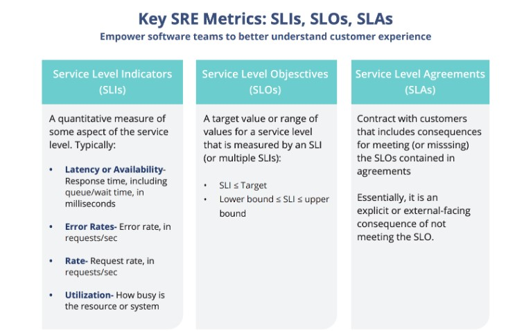
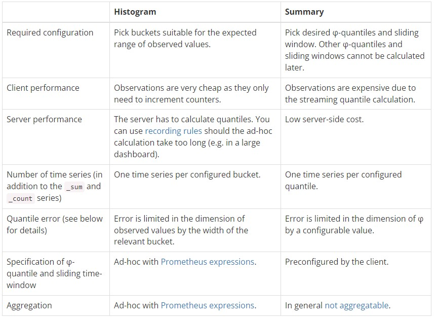

# Introduction
I did this course when I worked on the PCA certification. The table of contents is based on the CNCF curriculum for this exam.

- [Observability concepts](#observability-concepts)
   * [Metrics](#metrics)
   * [Understand logs and events](#understand-logs-and-events)
   * [Tracing and Spans](#tracing-and-spans)
   * [Push vs Pull](#push-vs-pull)
      + [Pull](#pull)
      + [Push](#push)
   * [Service Discovery](#service-discovery)
   * [Basics of SLOs, SLAs, and SLIs](#basics-of-slos-slas-and-slis)
- [Prometheus fundamentals](#prometheus-fundamentals)
   * [System Architecture](#system-architecture)
   * [Configuration and Scraping](#configuration-and-scraping)
   * [Understanding Prometheus Limitations](#understanding-prometheus-limitations)
   * [Data Model and Labels](#data-model-and-labels)
      + [Data model](#data-model)
      + [Labels](#labels)
   * [Exposition Format](#exposition-format)
- [PromQL](#promql)
   * [Presentation of metric types](#presentation-of-metric-types)
   * [Selecting Data](#selecting-data)
   * [Rates and Derivatives](#rates-and-derivatives)
      + [Rates](#rates)
      + [Derivatives](#derivatives)
   * [Aggregating over time](#aggregating-over-time)
   * [Aggregating over dimensions](#aggregating-over-dimensions)
   * [Binary operators](#binary-operators)
      + [Arithmetic binary operator](#arithmetic-binary-operator)
      + [Trigonometric binary operator](#trigonometric-binary-operator)
      + [Comparison binary operator](#comparison-binary-operator)
      + [Logical binary operator](#logical-binary-operator)
      + [Binary operator precedence](#binary-operator-precedence)
   * [Histograms](#histograms)
   * [Timestamp Metrics](#timestamp-metrics)
- [Instrumentation and exporters](#instrumentation-and-exporters)
   * [Client Libraries](#client-libraries)
   * [Instrumentation](#instrumentation)
   * [Exporters](#exporters)
      + [Definition of exporters](#definition-of-exporters)
      + [Exporters from community](#exporters-from-community)
      + [Making your own exporters](#making-your-own-exporters)
   * [Structuring and naming metrics](#structuring-and-naming-metrics)
- [Alerting and dashboarding](#alerting-and-dashboarding)
   * [Dashboarding basics](#dashboarding-basics)
   * [Configuring Alerting rules](#configuring-alerting-rules)
   * [Understand and Use Alertmanager](#understand-and-use-alertmanager)
   * [Alerting basics (when, what, and why)](#alerting-basics-when-what-and-why)
# Observability concepts

## Metrics

In layperson terms, metrics are numeric measurements. Time series means
that changes are recorded over time. What users want to measure differs
from applications. For a web server it might be request
time, for a database it might be number of active connections or number
of active queries etc.  
Metrics play an important role in understanding why your application is
working in a certain way. Let’s assume you are running a web application
and find that the application is slow. You will need some information to
find out what is happening with your application. For example the
application can become slow when the number of requests are high. If you
have the request count metric you can spot the reason and increase the
number of servers to handle the load.
<https://prometheus.io/docs/introduction/overview/>

## Understand logs and events

An event is a conceptual abstraction and a structured log is one
possible representation of that abstraction. The interesting part of the
conversation is where to draw the lines around that abstraction, the
technical implementation part is how to represent that event.

## Tracing and Spans

A trace is a collection of operations that represents a unique
transaction handled by an application and its constituent services. A
span represents a single operation within a trace.  
A trace is the complete processing of a request. The trace represents
the whole journey of a request as it moves through all of the services
of a distributed system.  
Trace is often visualized using a hierarchical bar chart. Similarly to
how Gantt charts represent subtask dependencies and durations in a
project, a distributed trace represents dependencies and duration of
different microservices processing the request.  

-   Trace exposes the execution path through a distributed system. Trace
    is composed of one or more spans.

-   Span in the trace represents one microservice in the execution path.
    For instance, a credit score check could be a span in a trace of a
    loan application processing. Spans can create multiple child spans,
    and every child span has exactly one parent span.

## Push vs Pull

### Pull

For the pull approach, the monitoring targets will not send anything to
the monitoring server. The server will “ask” the targets for the
metrics. For example Prometheus as a pull approach and is requesting the
targets with http.

### Push

The pull approcah consists of making the target sending their metrics to
the monitoring server. In the Prometheus case, if a target doesn’t
support pull but only push, we can use the “pushgateway” as an
intermediate.

## Service Discovery

In the Prometheus architecture, service discovery (SD) consists as a
best practice to improve the scalability/maintainability of the
infrastructure. Define your jobs in the prometheus config file and your
instances list for SD in exeternal files. The advantages of defining
instances in a separate file is that you can add once while prometheus
is running without the need of reload the config file.

## Basics of SLOs, SLAs, and SLIs

# Prometheus fundamentals

## System Architecture

The Prometheus ecosystem consists of multiple components, many of which
are optional:

-   the main Prometheus server which scrapes and stores time series data

-   client libraries for instrumenting application code

-   a push gateway for supporting short-lived jobs

-   special-purpose exporters for services like HAProxy, StatsD,
    Graphite, etc

-   an alertmanager to handle alerts

-   various support tools

Most Prometheus components are written in Go, making them easy to build
and deploy as static binaries.

## Configuration and Scraping

Config file written in yaml so quite easy to read and understand. After
the “global” key you will find based features like :

-   scrape_interval: periode that will use Prometheus for scraping the
    targets (1mn by default)

-   evaluation_interval: periode that will use Prometheus to check the
    rule file for the alerting part

-   scrape_timeout: periode that will use Prometheus to determine if a
    target is unreachable

-   rule_files: path of the file were we defined the rules for the
    triggers

-   alerting: the url and the port to send PUSH request to alertmanager
    that will send notifications

-   scrape_configs: the configuration of the jobs and the instances

## Understanding Prometheus Limitations

Prometheus values reliability. You can always view what statistics are
available about your system, even under failure conditions. If you need
100% accuracy, such as for per-request billing, Prometheus is not a good
choice as the collected data will likely not be detailed and complete
enough. In such a case you would be best off using some other system to
collect and analyze the data for billing, and Prometheus for the rest of
your monitoring.  
In addition, Prometheus can’t store logs, you will need te use some
others tools like Promtail + Loki.

## Data Model and Labels

### Data model

Prometheus fundamentally stores all data as time series: streams of
timestamped values belonging to the same metric and the same set of
labeled dimensions. Besides stored time series, Prometheus may generate
temporary derived time series as the result of queries.  
Prometheus is storing the data with a “key:value” reference. Here it’s a
timestamp (with a millisecond precision) associated with a value.  
<https://prometheus.io/docs/concepts/data_model/>

### Labels

Every time series is uniquely identified by its metric name and optional
key-value pairs called labels.  
The metric name specifies the general feature of a system that is
measured (e.g. http \_requests_total - the total number of HTTP requests
received). It may contain ASCII letters and digits, as well as
underscores and colons. It must match the regex
\[a-zA-Z\_:\]\[a-zA-Z0-9\_:\]\*.  
Labels enable Prometheus’s dimensional data model: any given combination
of labels for the same metric name identifies a particular dimensional
instantiation of that metric (for example: all HTTP requests that used
the method POST to the /api/tracks handler). The query language allows
filtering and aggregation based on these dimensions. Changing any label
value, including adding or removing a label, will create a new time
series.  
Label names may contain ASCII letters, numbers, as well as underscores.
They must match the regex \[a-zA-Z\_\]\[a-zA-Z0-9\_\]\*. Label names
beginning with \_\_ are reserved for internal use.  
Label values may contain any Unicode characters.  
A label with an empty label value is considered equivalent to a label
that does not exist.  
**For example, a time series with the metric name
api_http_requests_total and the labels method="POST" and
handler="messages" could be written like this:  
api_http_requests_total{method="POST", handler="messages"}**

## Exposition Format

For the http exposition, today metrics could be exposed with 2 ways.

-   Text-format : first created way to expose metrics to Prometheus just
    via plain text lines

-   OpenMetrics : OpenMetrics want to indroduce some standardisation in
    the exposition of the metrics, still in developpment

<https://github.com/prometheus/docs/blob/main/content/docs/instrumenting/exposition_formats.md>

# PromQL

## Presentation of metric types

-   Counter : A counter is a cumulative metric that represents a single
    monotonically increasing counter whose value can only increase or be
    reset to zero on restart. For example, you can use a counter to
    represent the number of requests served, tasks completed, or
    errors.  
    Do not use a counter to expose a value that can decrease. For
    example, do not use a counter for the number of currently running
    processes; instead use a gauge.

-   Gauge : A gauge is a metric that represents a single numerical value
    that can arbitrarily go up and down.  
    Gauges are typically used for measured values like temperatures or
    current memory usage, but also "counts" that can go up and down,
    like the number of concurrent requests.

-   Histogramm : A histogram samples observations (usually things like
    request durations or response sizes) and counts them in configurable
    buckets. It also provides a sum of all observed values.

-   Summary : Similar to a histogram, a summary samples observations
    (usually things like request durations and response sizes). While it
    also provides a total count of observations and a sum of all
    observed values, it calculates configurable quantiles over a sliding
    time window.

<https://prometheus.io/docs/concepts/metric_types/>

## Selecting Data

-   Instant vector :

    

-   Range vector :

    

<https://satyanash.net/software/2021/01/04/understanding-prometheus-range-vectors.html>

## Rates and Derivatives

### Rates

The “rate” function of Prometheus use the “variation rate” formula that
we know as below :
(*f*(*a*+*h*)−*f*(*a*))/*h*
It’s using the range vector that we saw earlier, you can have an
estimation about the metric “x” is evolving in the time. You can use it
like this :  
rate\[1m\] = (count at 2m - count at 1m) / 60 = (4423 - 4381) / 60 =
0.7  
Rate could be usefull to saw how fast a metric is evolving but it’s
**only available for counters**, not for gauges.

### Derivatives

Derivative, in monitoring, allow us to see how a metric is evolving per
second. It’s quite similar to rate but we will use derivative function
with gauges metrics only.

## Aggregating over time

This X_over_time(Y) function is usefull to compare multiple range
vectors. It will compare range vectors on se same interval and returning
an instant vector.

On the example below, we could imagine a series named
temperature_instant with 2 different value of the label {instance}.
{instance=”A”} and {instance=”B”} respectively blue and red colors. We
want to know the average temperature (not just a simple delta between
the first and last value) during a period of 5mn. By using
avg_over_time(temperature_instant\[5m\]) we will get :

-   {instance=”A”} : 45

-   {instance=”B”} : 15

Temporal aggregations do not retain the metric name in the result.  
It will aggregate the value of the different series.
<https://iximiuz.com/en/posts/prometheus-functions-agg-over-time/>

## Aggregating over dimensions

This section concern the aggregation operator. It’s a serie of fonction
that allows you to do some operations on a value of a metric. Thoose
operators are **only working with instant vectors**, not range
vectors.  
Under this you can find a list of the aggregation operators privided by
the official documentation :

-   sum (calculate sum over dimensions)

-   min (select minimum over dimensions)

-   max (select maximum over dimensions)

-   avg (calculate the average over dimensions)

-   group (all values in the resulting vector are 1)

-   stddev (calculate population standard deviation over dimensions)

-   stdvar (calculate population standard variance over dimensions)

-   count (count number of elements in the vector)

-   count_values (count number of elements with the same value)

-   bottomk (smallest k elements by sample value)

-   topk (largest k elements by sample value)

-   quantile (calculate *ϕ*-quantile (0  ≤ *ϕ*≤ 1) over dimensions)

We can add words after the request like **or, without** to sort the
result with a label value like this :  
**\<aggr-op\> \[without\|by (\<label list\>)\] (\[parameter,\] \<vector
expression\>)  
or  
(\[parameter,\] \<vector expression\>) \[without\|by (\<label
list\>)\]**  
Aggregation over dimension will look at the the sample of different
series with an instant vector.

## Binary operators

Prometheus’s query language supports basic logical and arithmetic
operators. For operations between two instant vectors, the matching
behavior can be modified.

### Arithmetic binary operator

To do some requests, Prometheus allows you to make some operations
between scalar/scalar, vector/scalar, and vector/vector value pairs.
Like bellow :

-   +

-   −

-   \*

-   /

-   %

-   <a href="^" class="uri">^</a>

### Trigonometric binary operator

The following trigonometric binary operators, which work in radians,
exist in Prometheus:  
atan2 (based on<https://pkg.go.dev/math#Atan2>)  
Trigonometric operators allow trigonometric functions to be executed on
two vectors using vector matching, which isn’t available with normal
functions. They act in the same manner as arithmetic operators.

### Comparison binary operator

-    = =

-   !=

-   \>

-   \<

-    \> =

-    \< =

### Logical binary operator

-   and (intersection)

-   or (union)

-   unless (complement)

### Binary operator precedence

1.  <a href="^" class="uri">^</a>

2.  \*, /, %, atan2

3.  +, -

4.   = =,!=, \< =,\<, \> =,\>

5.  and, unless

6.  or

## Histograms

Histogram is a specific type of metric, you can see bellow a
two-dimension representation :

Prometheus application of histograms is a little bit different than this
example.

-   Each bucket is cumulative, the value will always increase. The same
    example from a Prom view will give that :

    

-   Histograms values are composed of buckets (blue rectangle on the
    picture). Each bucket is composed of different values count inferior
    or equal to the bucket value.

An histogram metric includes 3 items:

-   A counter with the total number of measurements. The metric name
    uses the \_count suffix.

-   A counter with the sum of the values of all measurements. The metric
    name uses the \_sum suffix.

-   The histogram buckets are exposed as counters using the metric name
    with a \_bucket suffix and a le label indicating the bucket upper
    inclusive bound. Buckets in Prometheus are inclusive, that is a
    bucket with an upper bound of N (i.e., le label) includes all data
    points with a value less than or equal to N.

<https://www.timescale.com/blog/four-types-prometheus-metrics-to-collect/>
<https://prometheus.io/docs/practices/histograms/>
<https://andykuszyk.github.io/2020-07-24-prometheus-histograms.html>
<https://medium.com/mercari-engineering/have-you-been-using-histogram-metrics-correctly-730c9547a7a9>

## Timestamp Metrics

Timestamp is a int64 number in millisecond used to store and reference
the metric in the TSDB. Each sample/value in Prometheus is stored with a
value and a timestamp. <https://prometheus.io/docs/concepts/data_model/>

# Instrumentation and exporters

## Client Libraries

Before you can monitor your services, you need to add instrumentation to
their code via one of the Prometheus client libraries. These implement
the Prometheus metric types.  
Choose a Prometheus client library that matches the language in which
your application is written. This lets you define and expose internal
metrics via an HTTP endpoint on your application’s instance:

-   Go

-   Java or Scala

-   Python

-   Ruby

-   Rust

## Instrumentation

Instrumentation is a best practice that advise you to make all of your
applications exposing their own metrics. Like this, you could easily
monitor your programms and have a look on the activities of your code.  
You can use the Prometheus libraries for the langage that you use.

## Exporters

### Definition of exporters

Exporter are little servers that will find and expose metrics on an http
port. Prometheus will scrape the metrics expose by the exporter to put
it in it’s TSDB. It’s usefull because if an exporter exist for the
application or service that you want to minitor, you can quickly add
this to your Prometheus supervision.

### Exporters from community

There are some “official” exporters on the Github page of Prometheus.
But not enougth for everything. So there is a lot of “third-party”
exporters written by the community. Some can help you to monitor your
systems.  
For example : <https://github.com/arthur-ehrle/nsx-exporter>

### Making your own exporters

If you have a new need for a Prometheus monitoring, you can write your
Prometheus exporter by using the libaries that we mentionned before.  
You can refered to the best practives given by the Prometheus
documentation
<https://prometheus.io/docs/instrumenting/writing_exporters/>

## Structuring and naming metrics

There is some best pratices to follow when you create your own metrics.
<https://prometheus.io/docs/instrumenting/writing_exporters/#naming>  
Generally metric names should allow someone who is familiar with
Prometheus but not a particular system to make a good guess as to what a
metric means. A metric named http_requests_total is not extremely
useful - are these being measured as they come in, in some filter or
when they get to the user’s code? And requests_total is even worse, what
type of requests?  
With direct instrumentation, a given metric should exist within exactly
one file. Accordingly, within exporters and collectors, a metric should
apply to exactly one subsystem and be named accordingly.  
Metric names should never be procedurally generated, except when writing
a custom collector or exporter.  
Metric names for applications should generally be prefixed by the
exporter name, e.g. haproxy_up.

# Alerting and dashboarding

## Dashboarding basics

Dashboards acts as the presentation layer for a user. It’s the graph
that you will look frequently to get informations about a system. It has
to be a developped and effective system. Prometheus is not able to be
qualified as a data-visualisation tool. Of course, it has a web gui, but
it’s only usefull to test your PromQL queries. You should use a
third-party tool like Grafana to visualize your data.  
There is some recommandations for the creation of your dashboards that
you can find in the official documentation like :

-   Have no more than 5 graphs on a console.

-   Have no more than 5 plots (lines) on each graph. You can get away
    with more if it is a stacked/area graph.

-   When using the provided console template examples, avoid more than
    20-30 entries in the right-hand-side table.

## Configuring Alerting rules

Alerting with Prometheus is separated into two parts. Alerting rules in
Prometheus servers send alerts to an Alertmanager. The Alertmanager then
manages those alerts, including silencing, inhibition, aggregation and
sending out notifications via methods such as email, on-call
notification systems, and chat platforms.  
The main steps to setting up alerting and notifications are:

-   Setup and configure the Alertmanager

-   Configure Prometheus to talk to the Alertmanager

-   Create alerting rules in Prometheus

Just under, you can find a configuration example of the alert file from
Prometheus.

Prometheus will have a lot of conditions to start a trigger, the
expression has to be matched for a certain periode. To write the
expression, you have to use PromQL. If time condition is OK, the state
will come from “pending” to “active” and send a push request to
Alertmanager with some informations, like all the “label” defined in the
rule.

## Understand and Use Alertmanager

Alertmanager isn’t the tool that will create alerts. We saw that this
part was handled by Prometheus. Alertmanager is a notifier, it will
received triggers and send notifications via some channels inluding
informations. It was do that depending on the content of the label
alerts that he received.

For example you can define an alert in Prometheus with le label **team:
NOC-agents** and in Alertmanager you can say that the Alerts marked by
**team: NOC-agents** has to be forwarded to an API url to send SMS.

## Alerting basics (when, what, and why)

An alarm is a piece of configuration describing a system’s change in
state, most typically a highly undesirable one, through fluctuations of
data points in a timeseries. Alarms are made up of metric monitors and
date-time evaluations and may optionally nest other alarms.  
An alert is a notification of a potential problem, which can take one or
more of the following forms: email, SMS, phone call, or a ticket. An
alert is issued by an alarm when the system transitions through some
threshold, and this threshold breach is detected by a monitor. Thus, for
example, you may configure an alarm to alert you when the system exceeds
80% of CPU utilization for a continuous period of 10 minutes.  
A metric monitor is attached to a timeseries and evaluates it against a
threshold. The threshold consists of limits (expressed as the number of
data points) and the duration of the breach. When the arriving data
points fall below the threshold, exceed the threshold, or go outside the
defined range for long enough, the threshold is said to be breached and
the monitor transitions from clear into alert state. When the data
points fall within the limits of the defined threshold, the monitor
recovers and returns to clear state. Monitor states are used as factors
in the evaluation of alarm states.
